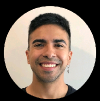
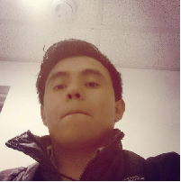
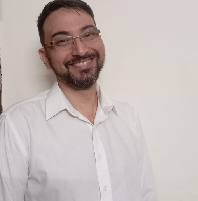
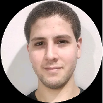
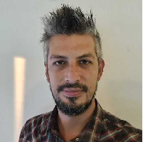
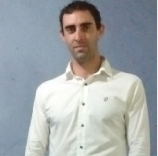

# h1-15-python-react

## Hackathon Justina.IO

Propuesta de aplicación de gestión de medicina para Justina.IO, dentro del marco del Hackathon de No Country.

Web de pruebas: https://justina-latam.vercel.app/

## Badges

Add badges from somewhere like: [shields.io](https://shields.io/)

## Equipo de desarrollo H1-15-Python-React

### Team Lider

### - _Yefferson Espinoza_

### Diseño UI/UX

#### - _Juan Ignacio Lobo_

### Frontend

#### - _Max Cereceda_

#### - _Rafael Strongoli_

#### - _Lautaro Duran_

### Backend

#### - _Félix Pacheco_

#### - _Fernando Suarez_

#### - _Damian Berrojalvis_

